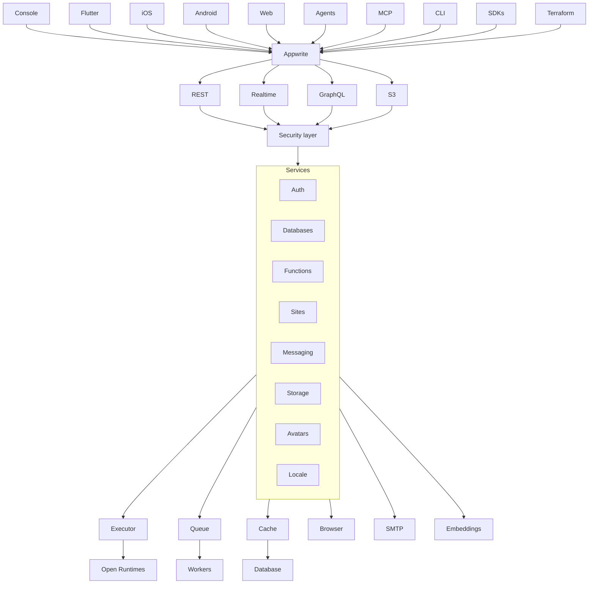

<br />
<p align="center">
    <h1>Appwrite</h1>
    <b>Appwrite is an open-source, all-in-one development platform. Use built-in backend infrastructure and web hosting, all from a single place.</b>
    <br />
    <br />
</p>

[](https://appwrite.io/discord)
[](https://x.com/appwrite)
[](https://cloud.appwrite.io)

English | [简体中文](README-CN.md)

Appwrite is an open-source development platform for building web, mobile, and AI applications. It brings together backend infrastructure and web hosting in one place, so teams can build, ship, and scale without stitching together a fragmented stack. Appwrite is available as a managed cloud platform and can also be self-hosted on infrastructure you control.

With Appwrite, you can add authentication, databases, storage, functions, messaging, realtime capabilities, and integrated web app hosting through Sites. It is designed to reduce the repetitive backend work required to launch modern products while giving developers secure primitives and flexible APIs to build production-ready applications faster.

Find out more at [https://appwrite.io](https://appwrite.io).

Table of Contents:

- [Products](#products)
- [Installation \& Setup](#installation--setup)
- [Self-Hosting](#self-hosting)
  - [Unix](#unix)
  - [Windows](#windows)
    - [CMD](#cmd)
    - [PowerShell](#powershell)
  - [Docker API version mismatch](#docker-api-version-mismatch)
  - [Upgrade from an Older Version](#upgrade-from-an-older-version)
- [One-Click Setups](#one-click-setups)
- [Getting Started](#getting-started)
  - [SDKs](#sdks)
    - [Client](#client)
    - [Server](#server)
- [Architecture](#architecture)
- [Contributing](#contributing)
- [Security](#security)
- [Follow Us](#follow-us)
- [License](#license)


## Products

- **[Appwrite Auth](https://appwrite.io/docs/products/auth)** - Secure user authentication with multiple login methods including email/password, SMS, OAuth, anonymous sessions, and magic links. Includes session management, multi-factor authentication, and user verification flows.

- **[Appwrite Databases](https://appwrite.io/docs/products/databases)** - Scalable structured data storage with support for databases, tables, and rows. Includes querying, pagination, indexing, and relationships to model complex application data.

- **[Appwrite Storage](https://appwrite.io/docs/products/storage)** - Secure file storage with support for uploads, downloads, encryption, compression, and file transformations for media and assets.

- **[Appwrite Functions](https://appwrite.io/docs/products/functions)** - Serverless compute platform to run custom backend logic in isolated runtimes, triggered by events or scheduled jobs.15 runtimes supported.

- **[Appwrite Messaging](https://appwrite.io/docs/products/messaging)** - Multi-channel messaging system for sending emails, SMS, and push notifications to users for engagement, alerts, and transactional workflows.

- **[Appwrite Sites](https://appwrite.io/docs/products/sites)** - Integrated hosting platform to deploy and scale web applications with support for custom domains, SSR, and seamless backend integration. Git integration and previews are supported.


## Installation & Setup

The easiest way to get started with Appwrite is by [signing up for Appwrite Cloud](https://cloud.appwrite.io/). While Appwrite Cloud is in public beta, you can build with Appwrite completely free, and we won't collect your credit card information.

## Self-Hosting

Appwrite is designed to run in a containerized environment. Running your server is as easy as running one command from your terminal. You can either run Appwrite on your localhost using docker-compose or on any other container orchestration tool, such as [Kubernetes](https://kubernetes.io/docs/home/), [Docker Swarm](https://docs.docker.com/engine/swarm/), or [Rancher](https://rancher.com/docs/).

Before running the installation command, make sure you have [Docker](https://www.docker.com/products/docker-desktop) installed on your machine:

### Unix

```bash
docker run -it --rm \
    --publish 20080:20080 \
    --volume /var/run/docker.sock:/var/run/docker.sock \
    --volume "$(pwd)"/appwrite:/usr/src/code/appwrite:rw \
    --entrypoint="install" \
    appwrite/appwrite:2.0.0
```

### Windows

#### CMD

```cmd
docker run -it --rm ^
    --publish 20080:20080 ^
    --volume //var/run/docker.sock:/var/run/docker.sock ^
    --volume "%cd%"/appwrite:/usr/src/code/appwrite:rw ^
    --entrypoint="install" ^
    appwrite/appwrite:2.0.0
```

#### PowerShell

```powershell
docker run -it --rm `
    --publish 20080:20080 `
    --volume /var/run/docker.sock:/var/run/docker.sock `
    --volume ${pwd}/appwrite:/usr/src/code/appwrite:rw `
    --entrypoint="install" `
    appwrite/appwrite:2.0.0
```

Once the Docker installation is complete, go to http://localhost to access the Appwrite console from your browser. Please note that on non-Linux native hosts, the server might take a few minutes to start after completing the installation.

### Docker API version mismatch

If install or upgrade fails with an error like `client version 1.52 is too new. Maximum supported API version is 1.42`, the Docker CLI inside the Appwrite image is newer than your host Docker Engine. Pass `DOCKER_API_VERSION` set to the maximum API version from the error (or upgrade Docker on the host):

```bash
docker run -it --rm \
    --env DOCKER_API_VERSION=1.42 \
    --publish 20080:20080 \
    --volume /var/run/docker.sock:/var/run/docker.sock \
    --volume "$(pwd)"/appwrite:/usr/src/code/appwrite:rw \
    --entrypoint="install" \
    appwrite/appwrite:2.0.0
```

Use the same `--env DOCKER_API_VERSION=...` flag with `--entrypoint="upgrade"` when upgrading.

For advanced production and custom installation, check out our Docker [environment variables](https://appwrite.io/docs/environment-variables) docs. You can also use our public [docker-compose.yml](https://appwrite.io/install/compose) and [.env](https://appwrite.io/install/env) files to manually set up an environment.

### Upgrade from an Older Version

If you are upgrading your Appwrite server from an older version, you should use the Appwrite migration tool once your setup is completed. For more information regarding this, check out the [Installation Docs](https://appwrite.io/docs/self-hosting).

## One-Click Setups

In addition to running Appwrite locally, you can also launch Appwrite using a pre-configured setup. This allows you to get up and running quickly with Appwrite without installing Docker on your local machine.

Choose from one of the providers below:

<table border="0">
  <tr>
    <td align="center" width="100" height="100">
      <a href="https://marketplace.digitalocean.com/apps/appwrite">
        
          <br /><sub><b>DigitalOcean</b></sub></a>
        </a>
    </td>
    <td align="center" width="100" height="100">
      <a href="https://www.linode.com/marketplace/apps/appwrite/appwrite/">
        
          <br /><sub><b>Akamai Compute</b></sub></a>
      </a>
    </td>
    <td align="center" width="100" height="100">
      <a href="https://aws.amazon.com/marketplace/pp/prodview-2hiaeo2px4md6">
        
          <br /><sub><b>AWS Marketplace</b></sub></a>
      </a>
    </td>
  </tr>
</table>

## Getting Started

Getting started with Appwrite is as easy as creating a new project, choosing your platform, and integrating its SDK into your code. You can easily get started with your platform of choice by reading one of our Getting Started tutorials.

| Platform              | Technology                                                                         |
| --------------------- | ---------------------------------------------------------------------------------- |
| **Web app**           | [Quick start for Web](https://appwrite.io/docs/quick-starts/web)                   |
|                       | [Quick start for Next.js](https://appwrite.io/docs/quick-starts/nextjs)            |
|                       | [Quick start for React](https://appwrite.io/docs/quick-starts/react)               |
|                       | [Quick start for Vue.js](https://appwrite.io/docs/quick-starts/vue)                |
|                       | [Quick start for Nuxt](https://appwrite.io/docs/quick-starts/nuxt)                 |
|                       | [Quick start for SvelteKit](https://appwrite.io/docs/quick-starts/sveltekit)       |
|                       | [Quick start for Refine](https://appwrite.io/docs/quick-starts/refine)             |
|                       | [Quick start for Angular](https://appwrite.io/docs/quick-starts/angular)           |
| **Mobile and Native** | [Quick start for React Native](https://appwrite.io/docs/quick-starts/react-native) |
|                       | [Quick start for Flutter](https://appwrite.io/docs/quick-starts/flutter)           |
|                       | [Quick start for Apple](https://appwrite.io/docs/quick-starts/apple)               |
|                       | [Quick start for Android](https://appwrite.io/docs/quick-starts/android)           |
| **Server**            | [Quick start for Node.js](https://appwrite.io/docs/quick-starts/node)              |
|                       | [Quick start for Python](https://appwrite.io/docs/quick-starts/python)             |
|                       | [Quick start for .NET](https://appwrite.io/docs/quick-starts/dotnet)               |
|                       | [Quick start for Dart](https://appwrite.io/docs/quick-starts/dart)                 |
|                       | [Quick start for Ruby](https://appwrite.io/docs/quick-starts/ruby)                 |
|                       | [Quick start for Deno](https://appwrite.io/docs/quick-starts/deno)                 |
|                       | [Quick start for PHP](https://appwrite.io/docs/quick-starts/php)                   |
|                       | [Quick start for Kotlin](https://appwrite.io/docs/quick-starts/kotlin)             |
|                       | [Quick start for Swift](https://appwrite.io/docs/quick-starts/swift)               |
|                       | [Quick start for Go](https://appwrite.io/docs/quick-starts/go)                     |
|                       | [Quick start for Rust](https://appwrite.io/docs/quick-starts/rust)                 |

### SDKs

Below is a list of currently supported platforms and languages. If you would like to help us add support to your platform of choice, you can go over to our [SDK Generator](https://github.com/appwrite/sdk-generator) project and view our [contribution guide](https://github.com/appwrite/sdk-generator/blob/master/CONTRIBUTING.md).

#### Client

- :white_check_mark: &nbsp; [Web](https://github.com/appwrite/sdk-for-web)
- :white_check_mark: &nbsp; [Flutter](https://github.com/appwrite/sdk-for-flutter)
- :white_check_mark: &nbsp; [Apple](https://github.com/appwrite/sdk-for-apple)
- :white_check_mark: &nbsp; [Android](https://github.com/appwrite/sdk-for-android)
- :white_check_mark: &nbsp; [React Native](https://github.com/appwrite/sdk-for-react-native)

#### Server

- :white_check_mark: &nbsp; [Node.js](https://github.com/appwrite/sdk-for-node)
- :white_check_mark: &nbsp; [Python](https://github.com/appwrite/sdk-for-python)
- :white_check_mark: &nbsp; [Dart](https://github.com/appwrite/sdk-for-dart)
- :white_check_mark: &nbsp; [PHP](https://github.com/appwrite/sdk-for-php)
- :white_check_mark: &nbsp; [Ruby](https://github.com/appwrite/sdk-for-ruby)
- :white_check_mark: &nbsp; [.NET](https://github.com/appwrite/sdk-for-dotnet)
- :white_check_mark: &nbsp; [Go](https://github.com/appwrite/sdk-for-go)
- :white_check_mark: &nbsp; [Swift](https://github.com/appwrite/sdk-for-swift)
- :white_check_mark: &nbsp; [Kotlin](https://github.com/appwrite/sdk-for-kotlin)
- :white_check_mark: &nbsp; [Rust](https://github.com/appwrite/sdk-for-rust)

Looking for more SDKs? - Help us by contributing a pull request to our [SDK Generator](https://github.com/appwrite/sdk-generator)!

## Architecture



Appwrite uses a microservices architecture that was designed for easy scaling and delegation of responsibilities. In addition, Appwrite supports multiple APIs, such as REST, WebSocket, and GraphQL to allow you to interact with your resources by leveraging your existing knowledge and protocols of choice.

The Appwrite API layer was designed to be extremely fast by leveraging in-memory caching and delegating any heavy-lifting tasks to the Appwrite background workers. The background workers also allow you to precisely control your compute capacity and costs using a message queue to handle the load. You can learn more about our architecture in [AGENTS.md](AGENTS.md).

## Contributing

All code contributions, including those of people having commit access, must go through a pull request and be approved by a core developer before being merged. This is to ensure a proper review of all the code.

We truly :heart: pull requests! If you wish to help, you can learn more about how you can contribute to this project in the [contribution guide](CONTRIBUTING.md).

## Security

Please see [SECURITY.md](SECURITY.md) for how to report a vulnerability. Do not open a public GitHub issue for security reports.

## Follow Us

Join our growing community around the world! Read the [Blog](https://appwrite.io/blog), or follow us on [Discord](https://appwrite.io/discord), [GitHub](https://github.com/appwrite), [X](https://x.com/appwrite), [LinkedIn](https://linkedin.com/company/appwrite), [YouTube](https://youtube.com/c/appwrite), [daily.dev](https://app.daily.dev/squads/appwrite), [Bluesky](https://bsky.app/profile/appwrite.io), [TikTok](https://tiktok.com/@appwrite), and [Instagram](https://instagram.com/appwrite.io).

## License

This repository is available under the [BSD 3-Clause License](./LICENSE).


## 🌐 Web Resources & Interactive Index
- [INDEX31](https://mindconvertjp.pages.dev/index31.html)
- [CATEGORY SHOP](https://playclass-ko.pages.dev/category-shop.html)
- [CATEGORY MANAGEMENT210](https://quizzesarena.onrender.com/category-management210.html)
- [TERMS](https://learnaction.netlify.app/terms.html)
- [ROPEWAY MASTER](https://eduquestkr.pages.dev/ropeway-master.html)
- [CODEQUEST](https://learnaction.netlify.app/codequest.html)
- [BRAINROT CLEANING](https://eduquestkr.pages.dev/brainrot-cleaning.html)
- [CATEGORY TRAFFIC34](https://eduquests.onrender.com/category-traffic34.html)
- [ARROWS PUZZLE ESCAPE](https://learnaction.netlify.app/arrows-puzzle-escape.html)
- [ZOMBIE FRONTIER SHOOTER](https://eduquestkr.pages.dev/zombie-frontier-shooter.html)
- [GAS STATION JUNKYARD TYCOON](https://playandlearn-fr.pages.dev/gas-station-junkyard-tycoon.html)
- [JIXORA JIGSAW SOLITAIRE PUZZLE](https://mindconvert.onrender.com/jixora-jigsaw-solitaire-puzzle.html)
- [CATEGORY ONE BUTTON84](https://eduquestsjp.pages.dev/category-one-button84.html)
- [BLOCK STACKING](https://eduquestkr.pages.dev/block-stacking.html)
- [TOWER OF HELL OBBY BLOX](https://thestudyquests9.pages.dev/tower-of-hell-obby-blox.html)
- [SPRUNKI PHASE BRAINROT](https://thestudyquests9.pages.dev/sprunki-phase-brainrot.html)
- [INDEX32](https://jangkhangplay.pages.dev/index32.html)
- [SPRUNKI MEMORY CARD MATCH](https://brainquesteses.pages.dev/sprunki-memory-card-match.html)
- [STACK N SORT](https://eduquests.netlify.app/stack-n-sort.html)
- [CATEGORY MERGE GAMES](https://thelearnquests-ru.pages.dev/category-merge-games.html)
- [TILE CONNECT CLUB](https://eduquestkr.pages.dev/tile-connect-club.html)
- [GT CHAMPIONSHIP ARCADE](https://thelearningarcades.pages.dev/gt-championship-arcade.html)
- [CATEGORY ONE BUTTON](https://welearnaction.onrender.com/category-one-button.html)
- [HALLOWEEN STORE SORT](https://thelearningarcades.pages.dev/halloween-store-sort.html)
- [SUPERMARKET MANAGER SIMULATOR](https://eduquestsjp.pages.dev/supermarket-manager-simulator.html)
- [COE RABBIT](https://eduquestkr.pages.dev/coe-rabbit.html)
- [FIGHT TO THE END](https://thebrainquests-hi.pages.dev/fight-to-the-end.html)
- [BULLET HEROES](https://thestudyquests-ja.pages.dev/bullet-heroes.html)
- [CATEGORY CARTOON76](https://eduquests.onrender.com/category-cartoon76.html)
- [MAHJONG PET QUEST](https://eduquests.netlify.app/mahjong-pet-quest.html)
- [OBBY RESCUE MISSION](https://eduquestkr.pages.dev/obby-rescue-mission.html)
- [STICK FIGHT THE CHAOS](https://eduquests.pages.dev/stick-fight-the-chaos.html)
- [STICKBOYS HOOK](https://eduquestsjp.pages.dev/stickboys-hook.html)
- [FIND HIDDEN SECRETS](https://studyarcade-vi.pages.dev/find-hidden-secrets.html)
- [MAGIC BUBBLES](https://eduquests.netlify.app/magic-bubbles.html)
- [CANDY RIDDLES](https://eduquestsjp.pages.dev/candy-riddles.html)
- [JUMP BALL CLASSIC](https://eduquestkr.pages.dev/jump-ball-classic.html)
- [THE ZOMBIE HOUSE](https://studyarcade-vi.pages.dev/the-zombie-house.html)
- [SOLITAIRE EMPEROR SECRETS OF FATE](https://learningarcade-en.pages.dev/solitaire-emperor-secrets-of-fate.html)
- [CATEGORY FPS 2](https://learningarcade-en.pages.dev/category-fps-2.html)
- [ZIP ZAP](https://learnaction.netlify.app/zip-zap.html)
- [THE FLOWERS MERGE AND SELL BOUQUETS](https://eduquestsjp.pages.dev/the-flowers-merge-and-sell-bouquets.html)
- [GEOMETRY STARS](https://learnaction.netlify.app/geometry-stars.html)
- [CATEGORY 2D1 070](https://thestudyarcades9.pages.dev/category-2d1-070.html)
- [GRUNGE CHIC ALT FASHION](https://eduquestsjp.pages.dev/grunge-chic-alt-fashion.html)
- [CATEGORY DRESS UP97](https://eduquestsjp.pages.dev/category-dress-up97.html)
- [CATEGORY BALL173](https://eduquestsjp.pages.dev/category-ball173.html)
- [ERASE THE EXTRA ELEMENT](https://learningarcade-en.pages.dev/erase-the-extra-element.html)
- [HUGGY MIX SPRUNKI MUSIC BOX](https://eduquestsjp.pages.dev/huggy-mix-sprunki-music-box.html)
- [CATEGORY PUZZLE 4](https://eduquestsjp.pages.dev/category-puzzle-4.html)
- [ZOMBIE SPACE EPISODE II](https://eduquestsjp.pages.dev/zombie-space-episode-ii.html)
- [DRAW TO KILL](https://theeduquests-ko.pages.dev/draw-to-kill.html)
- [SLINGSHOT MASTER](https://learnaction.netlify.app/slingshot-master.html)
- [CRUSH THE EGGS](https://eduquestsjp.pages.dev/crush-the-eggs.html)
- [POPCAT CLICKER](https://mindconvert.onrender.com/popcat-clicker.html)
- [EXIT PUZZLE](https://eduquestsjp.pages.dev/exit-puzzle.html)
- [SUDOKU VAULT](https://eduquestsjp.pages.dev/sudoku-vault.html)
- [CATEGORY PUZZLE 7](https://themindconvert.web.app/category-puzzle-7.html)
- [CATEGORY SCRATCH17](https://learningarcade-en.pages.dev/category-scratch17.html)
- [ATHENA MATCH](https://eduquests.pages.dev/athena-match.html)
- [PACKING LINE](https://eduquestsjp.pages.dev/packing-line.html)
- [CATEGORY MINECRAFT](https://learningarcade-en.pages.dev/category-minecraft.html)
- [CATEGORY PUZZLE 4](https://theeduplays9.pages.dev/category-puzzle-4.html)
- [DRILL QUEST](https://themindconvert.web.app/drill-quest.html)
- [RETRO STREET FIGHTER](https://learningarcade-en.pages.dev/retro-street-fighter.html)
- [PIRATES MATCH THE LOST TREASURE](https://learnaction.netlify.app/pirates-match-the-lost-treasure.html)
- [CATEGORY DESTROY256](https://eduquests.pages.dev/category-destroy256.html)
- [CATEGORY 2D1 060](https://eduquestsjp.pages.dev/category-2d1-060.html)
- [KINGS AND QUEENS SOLITAIRE TRIPEAKS](https://chuyentestss.pages.dev/kings-and-queens-solitaire-tripeaks.html)
- [CATEGORY CARTOON76](https://eduquestsjp.pages.dev/category-cartoon76.html)
- [TENTRIX](https://thestudyquests9.pages.dev/tentrix.html)
- [DRAWER SORT](https://learningarcade-en.pages.dev/drawer-sort.html)
- [CATEGORY EDUCATIONAL](https://themindquests-zh.pages.dev/category-educational.html)
- [FIRE SNAKE](https://thebrainquests-hi.pages.dev/fire-snake.html)
- [CS COMMAND SNIPERS](https://chuyentestss.pages.dev/cs-command-snipers.html)
- [LUNAAR ORG](https://mindconvert.onrender.com/lunaar-org.html)
- [PERFECT TIDY](https://learnaction.netlify.app/perfect-tidy.html)
- [SLINGSHOT CHICKEN](https://eduquestkr.pages.dev/slingshot-chicken.html)
- [PANDA KITCHEN IDLE TYCOON](https://eduquests.netlify.app/panda-kitchen-idle-tycoon.html)
- [WORMSARENAIO](https://themindconvert.web.app/wormsarenaio.html)
- [CAFE OWNER BUSINESS SIMULATOR](https://eduquestsjp.pages.dev/cafe-owner-business-simulator.html)
- [GEAR WARS](https://studyarcade-vi.pages.dev/gear-wars.html)
- [CHROME CARS GARAGE](https://learnaction.netlify.app/chrome-cars-garage.html)
- [WOOL SORTING](https://eduquests.netlify.app/wool-sorting.html)
- [CATEGORY ROBOT49](https://eduquestsjp.pages.dev/category-robot49.html)
- [FUNNY FEVER HOSPITAL](https://eduquests.netlify.app/funny-fever-hospital.html)
- [STACKTRIS 2048](https://thestudyarcades9.pages.dev/stacktris-2048.html)
- [BALLERINA CAPPUCCINA FIRST DATE](https://mindconvert.onrender.com/ballerina-cappuccina-first-date.html)
- [FOOTBALL PENALTY 2026](https://jangkhangkr.pages.dev/football-penalty-2026.html)
- [ARROW OUT AND LINKER](https://eduquestsjp.pages.dev/arrow-out-and-linker.html)
- [3D MAZE CONTROL](https://brainquestsfr.pages.dev/3d-maze-control.html)
- [LIGHT ACADEMIA FASHION](https://jangkhangplay.pages.dev/light-academia-fashion.html)
- [BID WARS 1 AUCTION SIMULATOR](https://quizzesarena.web.app/bid-wars-1-auction-simulator.html)
- [CARGO SKATES](https://studyarcade-vi.pages.dev/cargo-skates.html)
- [321 CHOOSE THE DIFFERENT](https://brainquestspt.pages.dev/321-choose-the-different.html)
- [PRACTICE ON ME](https://thestudyquests9.pages.dev/practice-on-me.html)
- [PORTALS](https://thestudyquests9.pages.dev/portals.html)
- [CATEGORY HERO72](https://theeduplays9.pages.dev/category-hero72.html)
- [SATISDOM](https://brainquestsjp.pages.dev/satisdom.html)
- [CATEGORY SURVIVAL366](https://learningarcade-en.pages.dev/category-survival366.html)
- [DARTS MASTERCARTOON 3D](https://eduquestkr.pages.dev/darts-mastercartoon-3d.html)
- [ARROW TAP PUZZLE](https://learningarcade-en.pages.dev/arrow-tap-puzzle.html)
- [WOODY HEXA](https://learnaction.netlify.app/woody-hexa.html)
- [CORNHOLE LEAGUE BOARD GAMES](https://jangkhangplay.pages.dev/cornhole-league-board-games.html)
- [QUBE 2048 ELF](https://eduplay-es.pages.dev/qube-2048-elf.html)
- [IDLE LAWNMOWER](https://theeduquests-ko.pages.dev/idle-lawnmower.html)
- [CONNECT BALLS NEW YEAR PUZZLES](https://eduquestkr.pages.dev/connect-balls-new-year-puzzles.html)
- [SCALA 40](https://studyarcade-vi.pages.dev/scala-40.html)
- [TINY CARS](https://brainquestses.pages.dev/tiny-cars.html)
- [BLACK PINK CHRISTMAS CONCERT](https://quizzesarena.web.app/black-pink-christmas-concert.html)
- [BLUE HEDGEHOG HILL DASH RIDE](https://eduquestkr.pages.dev/blue-hedgehog-hill-dash-ride.html)
- [UNSCREW WOOD PUZZLE](https://eduquests.pages.dev/unscrew-wood-puzzle.html)
- [CATEGORY BASKETBALL 2](https://mindconvertjp.pages.dev/category-basketball-2.html)
- [CATEGORY OBSTACLE299](https://mindconvertjp.pages.dev/category-obstacle299.html)
- [BURGER CAFE COOKING GAMES FOR KIDS](https://mindconvertjp.pages.dev/burger-cafe-cooking-games-for-kids.html)
- [CATEGORY MISSION206](https://theeduquests-ko.pages.dev/category-mission206.html)
- [CANNON MERGE](https://quizzesarena.web.app/cannon-merge.html)
- [BULLET SUPERHERO](https://eduquestkr.pages.dev/bullet-superhero.html)
- [MAHJONG QUEST CANDYLAND ADVENTURES](https://eduquestsjp.pages.dev/mahjong-quest-candyland-adventures.html)
- [CATEGORY BIKE](https://theeduplays9.pages.dev/category-bike.html)
- [UGC MATH RACE](https://thelearningarcades.pages.dev/ugc-math-race.html)
- [BACKROOMS SKIBIDI TERRORS](https://studyarcade-vi.pages.dev/backrooms-skibidi-terrors.html)
- [ARROW SURVIVAL 15 SECONDS](https://jangkhangplay.pages.dev/arrow-survival-15-seconds.html)
- [SHIPBUILDING TYCOON](https://thestudyquests9.pages.dev/shipbuilding-tycoon.html)
- [FOOTBALL FUN](https://themindconvert.web.app/football-fun.html)
- [FARM BLAST](https://thestudyquests9.pages.dev/farm-blast.html)
- [LIQUID PUZZLE](https://theeduquests-ko.pages.dev/liquid-puzzle.html)
- [CATEGORY ESCAPE](https://thelearningarcades9.pages.dev/category-escape.html)
- [TRALALA LA LA LA ITALIANO](https://mindconvertes.pages.dev/tralala-la-la-la-italiano.html)
- [GRANNY RETURNS 3D EVIL DESTINY](https://theeduquests-ko.pages.dev/granny-returns-3d-evil-destiny.html)


## 🌐 Web Resources & Interactive Index
- [ANIME DOLL DIY COSPLAY GIRL](https://thesmartquestpark-ja.pages.dev/anime-doll-diy-cosplay-girl.html)
- [CAPYBARA SKEWER MATCH](https://themindquests-zh.pages.dev/capybara-skewer-match.html)
- [STICKMAN GUYS DEFENSE](https://quizzesarena.web.app/stickman-guys-defense.html)
- [INDEX3](https://brainquestspt.pages.dev/index3.html)
- [CAPYBARA BLOCK DROP](https://ieduquests.web.app/capybara-block-drop.html)
- [CATEGORY INCREMENTAL388](https://themindfactorys.pages.dev/category-incremental388.html)
- [FEED ME MONSTERS IDLE BATTLE](https://learnclass-zh.pages.dev/feed-me-monsters-idle-battle.html)
- [HIDDEN OBJECTS LOST ISLAND 2](https://brainquests.pages.dev/hidden-objects-lost-island-2.html)
- [FRUIT MERGE ARENA](https://brainquestsfr.pages.dev/fruit-merge-arena.html)
- [OHPEACH IT](https://eduquestkr.pages.dev/ohpeach-it.html)
- [OBBY RAINBOW TOWER](https://eduquestkr.pages.dev/obby-rainbow-tower.html)
- [HARD ROCK ZOMBIE TRUCK](https://brainquestsfr.pages.dev/hard-rock-zombie-truck.html)
- [CATEGORY PREMIUM PERKS74](https://studyarcade-vi.pages.dev/category-premium-perks74.html)
- [CATEGORY COOKING](https://eduquests.netlify.app/category-cooking.html)
- [MONEY GRABBER](https://mindconvertpt.pages.dev/money-grabber.html)
- [RUMMY CLASSIC](https://theeduquests9.pages.dev/rummy-classic.html)
- [CLASH RUN](https://themindconvert.web.app/clash-run.html)
- [CATEGORY THINKY](https://jangkhangplay.pages.dev/category-thinky.html)
- [CATEGORY CASUAL](https://learningarcade-en.pages.dev/category-casual.html)
- [CATEGORY SOLDIER](https://brainquestsfr.pages.dev/category-soldier.html)
- [CATEGORY MMO25](https://mindconvert.onrender.com/category-mmo25.html)
- [EMOJI GUESS](https://studygames-ru.pages.dev/emoji-guess.html)
- [2048 BLOCK FUSION](https://quizzesarena.onrender.com/2048-block-fusion.html)
- [CATEGORY FOOTBALL](https://gamelearning-pt.pages.dev/category-football.html)
- [SHAPE SHIFT](https://eduquests.netlify.app/shape-shift.html)
- [CATEGORY IDLE](https://knowledgequest-vi.pages.dev/category-idle.html)
- [INDEX13](https://learnaction.netlify.app/index13.html)
- [FLIGHT PILOT AIRPLANE GAMES 24](https://studygames-ru.pages.dev/flight-pilot-airplane-games-24.html)
- [INDEX19](https://skillgames-zh.pages.dev/index19.html)
- [EARTH DEFENDER](https://brainquestses.pages.dev/earth-defender.html)
- [CRAFTMART](https://mindconvert.pages.dev/craftmart.html)
- [EMERLAND SOLITAIRE](https://themindconvert.web.app/emerland-solitaire.html)
- [INDEX23](https://mindconvertes.pages.dev/index23.html)
- [BATTLE RACING STARS](https://themindquests-zh.pages.dev/battle-racing-stars.html)
- [CUBE KING](https://learnquest-ru.pages.dev/cube-king.html)
- [CATEGORY STICKMAN 2](https://brainquests.pages.dev/category-stickman-2.html)
- [CATEGORY SOLDIER](https://studygames-ru.pages.dev/category-soldier.html)
- [CATEGORY MONSTER206](https://eduquest-ko.pages.dev/category-monster206.html)
- [SPLIT SHOT BALL ADVENTURE](https://thelearningarcades-en.pages.dev/split-shot-ball-adventure.html)
- [HEXA SORT WINTER EDITION](https://jangkhangplay.pages.dev/hexa-sort-winter-edition.html)
- [CATEGORY CARE](https://learnquest-ru.pages.dev/category-care.html)
- [FOOTBALL PENALTY](https://jangkhangplay.pages.dev/football-penalty.html)
- [DUALIGHT A REFLECTED GAME](https://brainquest-hi.pages.dev/dualight-a-reflected-game.html)
- [CATEGORY FREE SOLITAIRE GAMES](https://studyquest-ja.pages.dev/category-free-solitaire-games.html)
- [CATEGORY MINING75](https://theeduplays-es.pages.dev/category-mining75.html)
- [DEATH BALL](https://gamelearning-pt.pages.dev/death-ball.html)
- [TOWN RUN](https://mindgames-hi.pages.dev/town-run.html)
- [NOOB VILLAGE TOWER DEFENSE](https://eduquest-ko.pages.dev/noob-village-tower-defense.html)
- [SISYPHUS SIMULATOR](https://mindconvertfr.pages.dev/sisyphus-simulator.html)
- [BLOCK MANIA](https://themindconvert.web.app/block-mania.html)
- [CATEGORY TOOLS](https://mindconvert.netlify.app/category-tools.html)
- [CATEGORY IDLE CLICKER GAME](https://eduquestkr.pages.dev/category-idle-clicker-game.html)
- [PARK ME DRAW PATH](https://themindquests9.pages.dev/park-me-draw-path.html)
- [INDEX7](https://learnquest-ru.pages.dev/index7.html)
- [TCG CARD CLICKER](https://playandlearn-fr.pages.dev/tcg-card-clicker.html)
- [CLOSED CITY](https://studygames-ru.pages.dev/closed-city.html)
- [CATEGORY MISSION206](https://themindquests-zh.pages.dev/category-mission206.html)
- [LIGHT ACADEMIA FASHION](https://jangkhangplay.pages.dev/light-academia-fashion.html)
- [EMOJI CHALLENGE](https://braingames-ko.pages.dev/emoji-challenge.html)
- [TOWER GUARDIAN EPIC DEFENSE](https://studygames-ru.pages.dev/tower-guardian-epic-defense.html)
- [CATEGORY ANIMAL216](https://gamelearning-pt.pages.dev/category-animal216.html)
- [CATEGORY MINING75](https://thestudyquests-ja.pages.dev/category-mining75.html)
- [COLLECT BRAINROT ARENA](https://themindquests9.pages.dev/collect-brainrot-arena.html)
- [AIR BLOCK](https://eduquest-ko.pages.dev/air-block.html)
- [FROGIO](https://brainquest-hi.pages.dev/frogio.html)
- [MONSTER DASH](https://thebrainquests-hi.pages.dev/monster-dash.html)
- [SKYDOM REFORGED](https://eduquestkr.pages.dev/skydom-reforged.html)
- [STUNT RIDER](https://eduquest-ko.pages.dev/stunt-rider.html)
- [CATEGORY MOBILE2 112](https://themindquests9.pages.dev/category-mobile2-112.html)
- [WORM OUT BRAIN TEASER GAMES](https://mindgames-hi.pages.dev/worm-out-brain-teaser-games.html)
- [DIGITAL AQUA](https://theeduquests-ko.pages.dev/digital-aqua.html)
- [ROYAL REBELLION PUNK MAGIC](https://playworld-es.pages.dev/royal-rebellion-punk-magic.html)
- [COLOR WOOD ANIMAL JAM](https://brainquest-hi.pages.dev/color-wood-animal-jam.html)
- [ROCKET SKY](https://playandlearn-fr.pages.dev/rocket-sky.html)
- [CHECKERS DELUXE EDITION](https://mindconvertfr.pages.dev/checkers-deluxe-edition.html)
- [CATEGORY STORY45](https://brainquestses.pages.dev/category-story45.html)
- [GEOMETRY LITE](https://braingames-ko.pages.dev/geometry-lite.html)
- [WOLF LIFE SIMULATOR](https://studygames-ru.pages.dev/wolf-life-simulator.html)
- [RIDERS DOWNHILL RACING](https://quizzesarena.web.app/riders-downhill-racing.html)
- [MAHJONG MAGIC ISLANDS](https://eduquestses.pages.dev/mahjong-magic-islands.html)
- [CATEGORY SCIENCE](https://brainquestsjp.pages.dev/category-science.html)
- [TOY ASSEMBLY 3D](https://braingames-ko.pages.dev/toy-assembly-3d.html)
- [INDEX13](https://studyquest-ja.pages.dev/index13.html)
- [CHROMA TREK](https://mindconvert.pages.dev/chroma-trek.html)
- [FASHION WORLD SIMULATOR](https://gamelearning-pt.pages.dev/fashion-world-simulator.html)
- [STICKMAN FIGHT PRO](https://eduquest-ko.pages.dev/stickman-fight-pro.html)
- [INDEX12](https://brainquest-hi.pages.dev/index12.html)
- [PUZZLE ABOUT ORANGE](https://theplayandlearns-fr.pages.dev/puzzle-about-orange.html)
- [SAVAGE DEFENDERS](https://theplayandlearns-fr.pages.dev/savage-defenders.html)
- [TROPICAL MATCH](https://theeduplays-es.pages.dev/tropical-match.html)
- [MATCH COLLECTION](https://mindgames-hi.pages.dev/match-collection.html)
- [MAKEUP STUDIO GLAM DIVA](https://gamelearning-pt.pages.dev/makeup-studio-glam-diva.html)
- [BUBBLY LAB](https://themindquests9.pages.dev/bubbly-lab.html)
- [CATEGORY FASHION](https://jangkhangplay.pages.dev/category-fashion.html)
- [SWEET MATCH](https://playworld-es.pages.dev/sweet-match.html)
- [SAUSAGE MAN SHOOTING ADVENTURE](https://themindquests-zh.pages.dev/sausage-man-shooting-adventure.html)
- [CUT IN HALF](https://playandlearn-fr.pages.dev/cut-in-half.html)
- [SPIDER SOLITAIRE 2 SUITS](https://eduquestses.pages.dev/spider-solitaire-2-suits.html)
- [CHALLENGER CITY DRIVER](https://gamelearning-pt.pages.dev/challenger-city-driver.html)
- [SLIDEE](https://gamelearning-pt.pages.dev/slidee.html)
- [KINGDOM CATS](https://mindconvertfr.pages.dev/kingdom-cats.html)
- [PORTAL MASTER](https://playandlearn-fr.pages.dev/portal-master.html)
- [ITALIAN BRAINROT FIND THE DIFFERENCES](https://braingames-ko.pages.dev/italian-brainrot-find-the-differences.html)
- [DUSTY CAT](https://playworld-es.pages.dev/dusty-cat.html)
- [STOLEN HOUSE](https://brainquestses.pages.dev/stolen-house.html)
- [BATTLE ARENA RACE TO WIN](https://theeduplays-es.pages.dev/battle-arena-race-to-win.html)
- [100 ROOMS ESCAPE](https://brainquestskr.pages.dev/100-rooms-escape.html)
- [WHAT S THE DIFFERENCE ONLINE](https://mindconvertes.pages.dev/what-s-the-difference-online.html)
- [CLASH CROWD GAME](https://studygames-ru.pages.dev/clash-crowd-game.html)
- [EASTERN STAR VS CITY STYLE ICON](https://brainquests.pages.dev/eastern-star-vs-city-style-icon.html)
- [COUNTRYSIDE DRIVING QUEST](https://theplayandlearns-fr.pages.dev/countryside-driving-quest.html)
- [MASTER ADDICTION SOLITAIRE](https://themindquests9.pages.dev/master-addiction-solitaire.html)
- [CATEGORY PUZZLE 3](https://thebrainquests-hi.pages.dev/category-puzzle-3.html)
- [CATEGORY IO](https://studygames-ru.pages.dev/category-io.html)
- [CATEGORY STICKMAN 2](https://thelearningarcades-en.pages.dev/category-stickman-2.html)
- [BEAM DRIVE CAR CRASH TEST SIMULATOR](https://brainquestskr.pages.dev/beam-drive-car-crash-test-simulator.html)
- [ARCHERY RAGDOLL](https://quizzesarena.web.app/archery-ragdoll.html)
- [SEEK FIND](https://braingames-ko.pages.dev/seek-find.html)
- [BOUNCY BARN](https://jangkhangplay.pages.dev/bouncy-barn.html)
- [DAILY SOLITAIRE MAHJONG CLASSIC](https://playworld-es.pages.dev/daily-solitaire-mahjong-classic.html)
- [TILE LIVING](https://brainquestses.pages.dev/tile-living.html)
- [CATEGORY CAN T STOP PLAYING215](https://learningarcade-en.pages.dev/category-can-t-stop-playing215.html)
- [MAGIC SOLITAIRE](https://quizzesarena.web.app/magic-solitaire.html)
- [SUMMER SPOTLIGHT DIFFERENCES](https://studygames-ru.pages.dev/summer-spotlight-differences.html)
- [PUMPKING VS MUMMY](https://themindquests9.pages.dev/pumpking-vs-mummy.html)
- [CATEGORY RACING127](https://eduquests.netlify.app/category-racing127.html)
- [BALL AND GIRLFRIEND](https://mindconvertfr.pages.dev/ball-and-girlfriend.html)
- [CATEGORY SNAKE](https://themindquests-zh.pages.dev/category-snake.html)
- [COLOR WAVEE](https://braingames-ko.pages.dev/color-wavee.html)
- [REAL STREET FIGHTER 3D](https://theeduquests-ko.pages.dev/real-street-fighter-3d.html)
